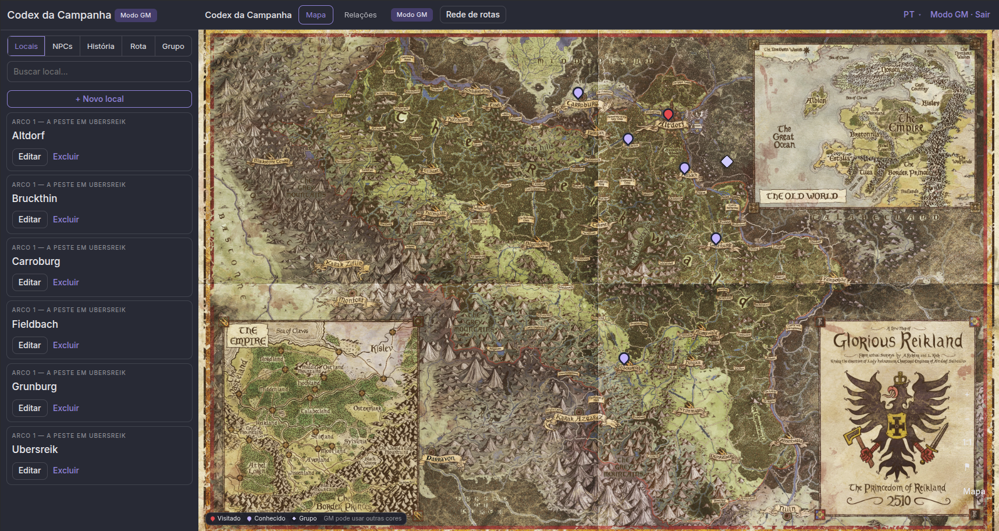
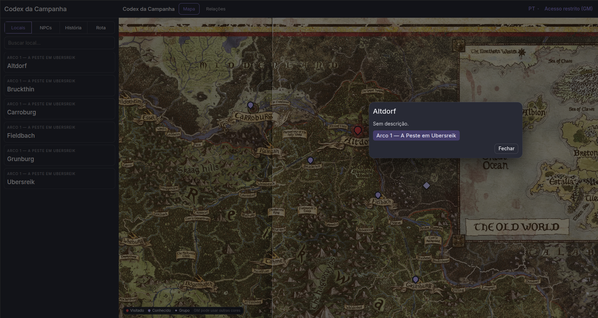
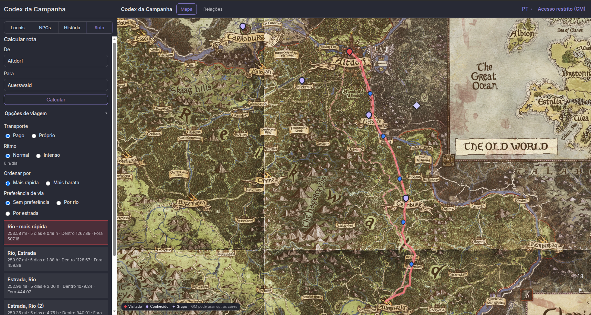
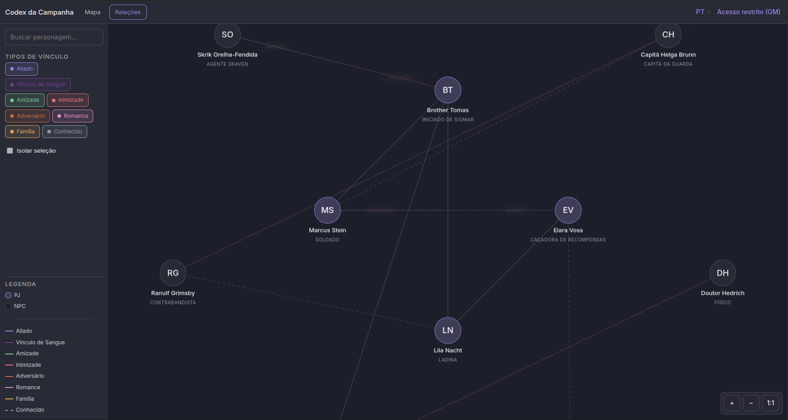
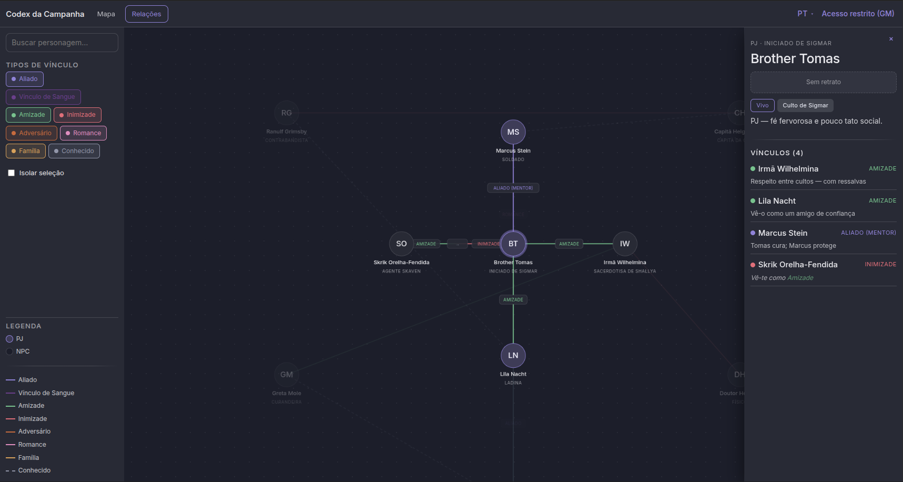
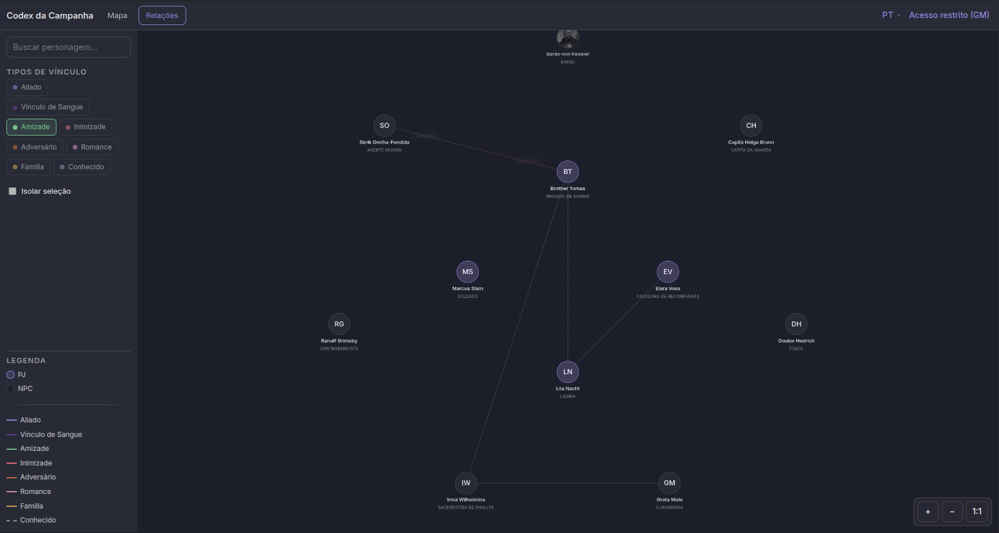

# Codex da Campanha

Aplicação web self-hosted para acompanhar campanhas de RPG de mesa: **mapa** interativo, **rotas**, **rede de relações** entre personagens e **Modo GM** na mesma interface.

**Versão:** 0.16.1 — [`CHANGELOG.md`](CHANGELOG.md)  
**Produção:** [`docs/plano-producao.md`](docs/plano-producao.md) · multi-instância: [`docs/runbook-instancias.md`](docs/runbook-instancias.md) · upgrade `/opt/map-campaign`: [`docs/migracao-producao-map-campaign.md`](docs/migracao-producao-map-campaign.md)

---

## Capturas de ecrã

### Mapa (Modo GM)



### Ficha de local



### Calcular rota



### Rede de Relações



### Ficha de personagem na Rede



### Filtros e legenda de vínculos



---

## Funcionalidades

### Mapa interativo

- Zoom e pan (roda suave + pinch); controlos `+` / `−` / `1:1` e **Ir ao grupo**
- Pins de locais com cor livre e convenção visual (visitado / conhecido); marcador do **grupo** (bandeira ou brasão)
- Tamanho de ecrã estável dos pins ao zoom
- Clique no pin (jogador) ou no local no menu foca a vista com pan/zoom animado
- Modal de leitura ao lado do pin (descrição em texto ou Markdown seguro)
- Hover no menu destaca o pin **sem** mover a câmara; pré-visualiza linhas de saída quando não há selecção
- Com local aberto: linhas de **saídas** no mapa
- Sem imagem de mapa na instância: a app abre directamente em **Relações**

### Locais, NPCs e História

- Menu lateral com abas Locais, NPCs, História, Rota e Grupo
- Listas com scroll e busca
- Locais agrupados por arco; NPCs com status, facção, retrato e papel
- Personagens unificados (PJ / NPC) na Rede de Relações

### Rotas e viagem

- Rede de vias (estrada / rio / trilha) digitalizada pelo GM
- **Calcular rota**: De/Para entre nós nomeados; transporte pago/próprio; ritmo; ordenação por tempo ou custo; preferência de via
- Várias alternativas no mapa (mais rápida destacada)
- Vincular nó da rede ↔ Local (o pin segue o nó)

### Rede de Relações (`/relacoes`)

- Grafo PJ/NPC com zoom (roda + pinch), pan e arrastar nós (só na sessão)
- **8 tipos** de vínculo com cor/estilo: Aliado, Vínculo de Sangue, Amizade, Inimizade, Adversário, Romance, Família, Conhecido
- Modo recíproco ou **duas vias**; qualificador opcional (ex. Mentor, Lacaio, Medo); direcção opcional (mútuo / A→B / B→A)
- Filtros por tipo, busca, isolar selecção, legenda PJ/NPC
- Painel de detalhe com ficha e lista de vínculos
- GM: criar/editar personagens e conexões; ocultar sentidos aos jogadores

### Modo GM

- Gate “Acesso restrito (GM)” na barra (ou `/?gm=1`) — sem dica de senha na UI
- CRUD de locais (cor do pin, saídas, nó da rede, Markdown), NPCs/personagens, arcos; upload de imagens; mover grupo
- Substituir a imagem do mapa; **Rede de rotas** para digitalizar waypoints/segmentos (coluna lateral / bottom sheet no mobile)
- API de escrita protegida com HTTP Basic Auth

### Multi-sistema e multi-campanha

- Config por deploy: `SISTEMA`, `MODULOS_ATIVOS`; `GET /api/config`
- Extensões mecânicas por personagem (ex. **fadiga** 0–6 quando o módulo está activo)
- Scaffold `./scripts/nova-campanha.sh` e hub índice estático em [`hub/`](hub/)
- Migração WFRP: `./scripts/migrar-wfrp.sh`

### Interface

- Design system **Nocturne** (tema escuro)
- Idiomas **PT-BR** e **EN** (combo-box na barra; conteúdo escrito pelo mestre não é traduzido)
- Erros da API surfaced com códigos estruturados e mensagens localizadas

---

## Stack

| Camada | Tecnologia |
|---|---|
| Frontend | React + Vite + TypeScript + Nocturne DS + `react-i18next` |
| Backend | FastAPI + SQLModel + SQLite + HTTP Basic Auth em `/api/admin/*` |
| Infra | Docker Compose + Caddy (opcional); hub estático multi-campanha |

---

## Desenvolvimento

### Backend

```bash
cd backend
uv sync
# Defina ADMIN_USER e ADMIN_PASSWORD no .env (obrigatório para Modo GM)
uv run uvicorn app.main:app --reload --port 8000

# Seed opcional (só dev/teste)
uv run python -m app.seed
```

Detalhes: [`backend/README.md`](backend/README.md)

### Frontend

```bash
cd frontend
npm install
npm run dev
```

http://localhost:5173 — proxy `/api` e `/uploads` → `:8000`

Detalhes: [`frontend/README.md`](frontend/README.md)

- `/` — Mapa (jogador + Modo GM in-page)
- `/relacoes` — Rede de Relações
- `/admin` — redireciona para `/?gm=1`
- Credenciais: senha = `ADMIN_PASSWORD`; usuário Basic = `ADMIN_USER` / `VITE_ADMIN_USER` (default `gm`)

### Docker

```bash
cp .env.example .env
# Preencha ADMIN_USER, ADMIN_PASSWORD (e ADMIN_PASSWORD_HASH para Caddy)
# Senhas com `$`: no Compose use `$$` ou aspas simples
docker compose up --build
docker compose --profile with-caddy up --build   # porta 8080
```

### Multi-instância

- Scaffold: `./scripts/nova-campanha.sh <nome> <porta-api> <porta-web> <sistema>`
- Hub: pasta [`hub/`](hub/)
- Runbook: [`docs/runbook-instancias.md`](docs/runbook-instancias.md)

---

## Segurança

- Leitura pública; escrita em `/api/admin/*` exige **Basic Auth** na API (fail closed sem `ADMIN_USER` / `ADMIN_PASSWORD`)
- Gate na SPA: dialog “Acesso do Mestre”
- Caddy pode reforçar rotas GM em produção
- Jogadores vêem actualizações ao **recarregar** (sem sync ao vivo)

---

## Documentação

| Recurso | Conteúdo |
|---|---|
| [`CHANGELOG.md`](CHANGELOG.md) | Histórico de versões |
| [`docs/runbook-instancias.md`](docs/runbook-instancias.md) | Actualizar / criar instâncias multi-campanha |
| [`docs/migracao-producao-map-campaign.md`](docs/migracao-producao-map-campaign.md) | Upgrade da instalação actual em `/opt/map-campaign` |
| [`specs/`](specs/) | Specs Speckit por funcionalidade (histórico de desenho) |
| [`frontend/README.md`](frontend/README.md) · [`backend/README.md`](backend/README.md) | Detalhe por camada |
