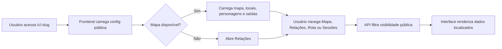
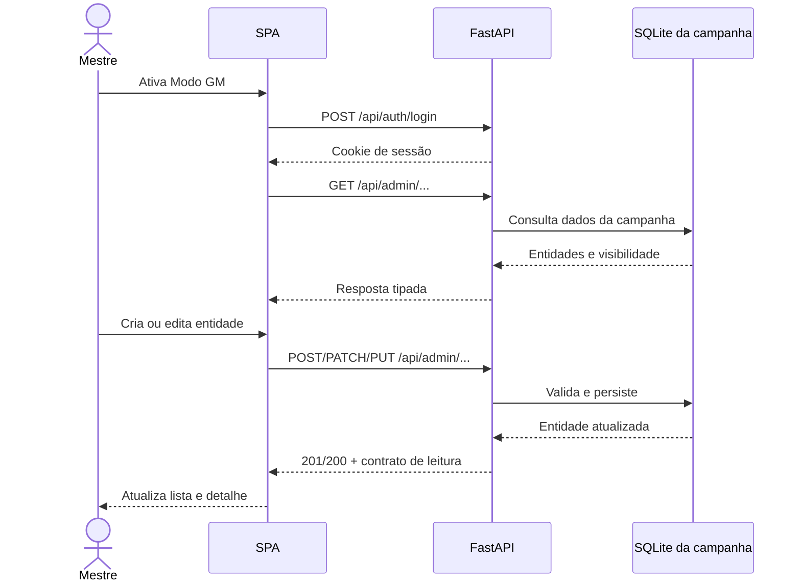
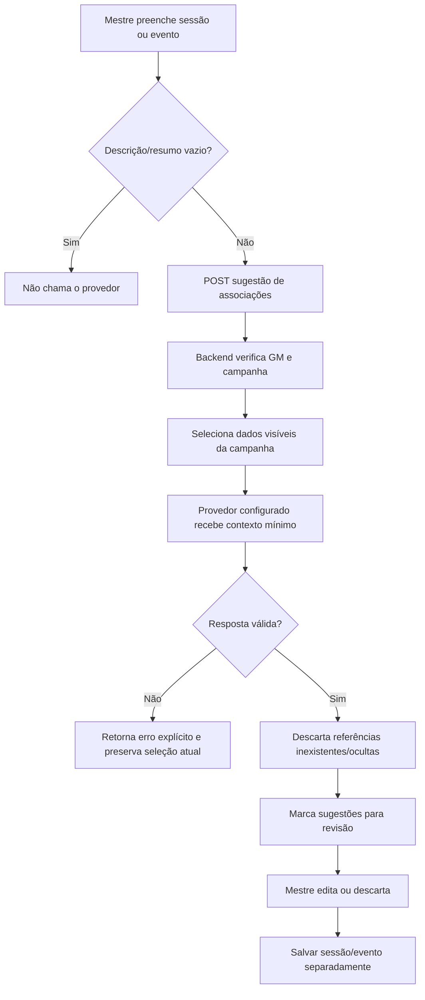
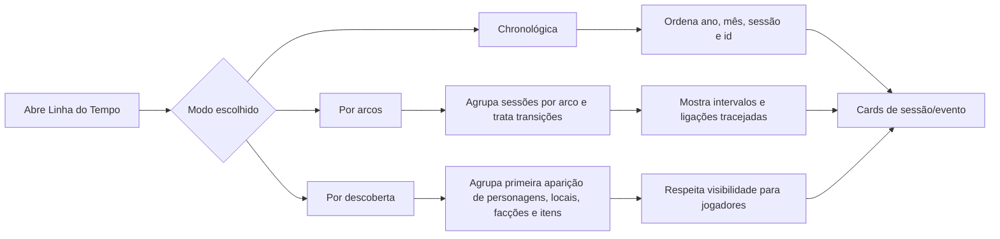
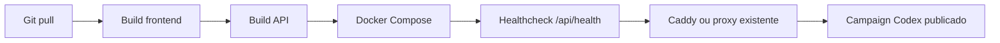

# Fluxos do Campaign Codex

Diagramas de referência dos fluxos principais da versão 0.24.5. Eles descrevem o comportamento observado na aplicação e complementam o contrato OpenAPI em [`api-contracts.md`](api-contracts.md).

## Entrada pública da campanha

## Sessão de mestre e CRUD

## Sugestão de associações por IA

## Linha do Tempo por arcos e descoberta

## Deploy e operação

